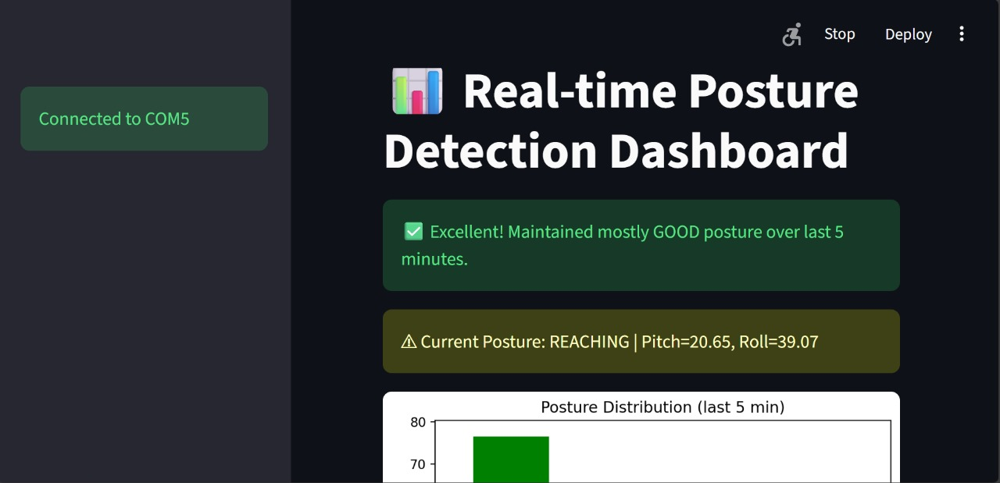
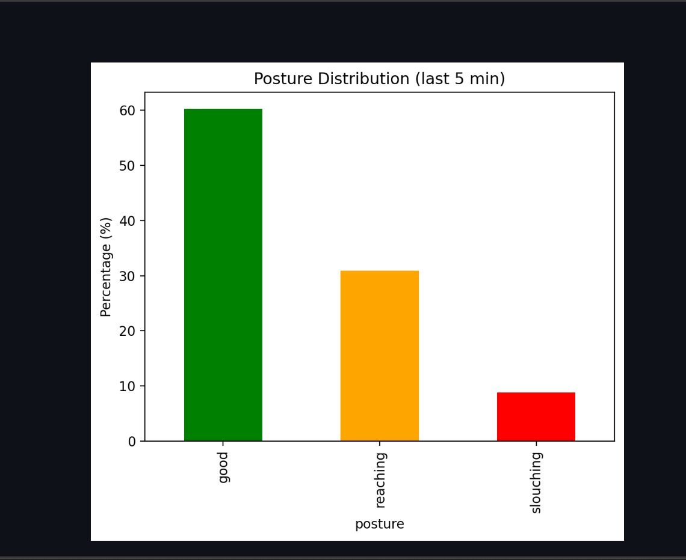
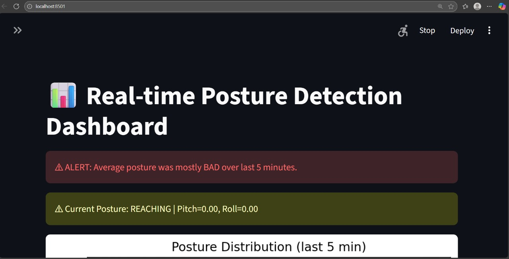

#  PostureGuard: AI-Powered Spinal Wellness System

 **A smart IoT solution merging Embedded Systems and Machine Learning to combat sedentary health issues by monitoring real-time posture.**

## Overview
In an era of remote work and long study hours, "Text Neck" and spinal misalignment are rising. **PostureGuard** uses an **MPU6050 Inertial Measurement Unit** and a custom **Machine Learning model** to detect sitting habits and provide instant feedback.

## Key Features
- **Real-time Analytics:** Constant monitoring of 3-axis acceleration and tilt.
- **Intelligent Classification:** Uses ML to distinguish between **Good Posture**, **Slouching**, and **Bad Alignment**.
- **Edge Intelligence:** Efficient data processing for low-latency feedback.
- **Web Interface:** A sleek dashboard to visualize your current posture status.

## Project Preview

Here is the real-time monitoring system in action, showing how the model classifies posture based on sensor data.

| Posture Classification | Analytical Breakdown |
| :---: | :---: |
|  |  |
| *Real-time feedback for "Excellent" posture.* | *Percentage breakdown of sitting habits.* |

---

### Negative Posture Alert
The system also detects when a user is reaching or slouching, providing immediate visual feedback:

  

## Tech Stack

### **Hardware**
- **Microcontroller:** Arduino (Processing & Data Acquisition)
- **Sensor:** MPU6050 (Accelerometer + Gyroscope)

### **Software & AI**
- **Language:** Python 3.x
- **Libraries:** NumPy, Pandas, Scikit-Learn
- **Interface:** HTML/CSS & Tailwind CSS (Glassmorphism UI)

---

## How It Works
1. **Data Collection:** The MPU6050 captures raw accelerometer data from the user's upper back.
2. **Feature Engineering:** Raw data is converted into pitch and roll angles.
3. **ML Inference:** The `posture.py` script runs a pre-trained model to classify the angle data.
4. **Alert System:** If "Slouching" is detected for more than 30 seconds, an alert is triggered.

---
              
